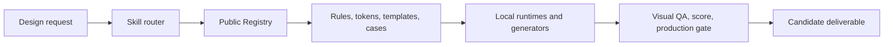

# NERO Design Team

<p align="center">
  
</p>

<p align="center">
  <strong>A governed design operating system for coding agents.</strong><br>
  Turn one-off AI visual work into routed, reusable, and verifiable delivery.
</p>

<p align="center">
  English · <a href="README.zh-CN.md">简体中文</a>
</p>

<p align="center">
  <code>Apache-2.0</code> · <code>79 public assets</code> · <code>15 recipes</code> · <code>12 local MCP-lite tools</code>
</p>

NERO Design Team (NDT) gives a coding agent more than a visual prompt. It routes the task, selects reusable design assets, runs deterministic local tools where possible, and keeps QA and promotion states explicit.

The package covers frontend UI, research images, deterministic report figures, presentation workflows and downstream handoffs, web decks, short video, AI-image briefs, visual review, scoring, and production checks.

> **Public boundary:** this repository is a public-safe, non-authoritative derivative. Client material, private identities, official brand assets, private preview media, and restricted third-party assets are deliberately excluded.

## Why NDT

Coding agents can generate a screen or slide quickly. The hard part is making the next output consistent with the last one, using known assets, respecting evidence boundaries, and proving that the result passed the right checks.

NDT makes that path explicit:

- **Route:** classify the deliverable before choosing tools.
- **Reuse:** select registered rules, tokens, templates, cases, and recipes.
- **Render:** prefer deterministic local runtimes for exact text, data, and geometry.
- **Verify:** run visual QA, scoring, and production gates before promotion.

| Capability | Component library | Prompt collection | NERO Design Team |
|---|---:|---:|---:|
| UI components | Primary focus | No | Optional input |
| Design-task routing | No | Informal | Yes |
| Reusable asset Registry | No | No | 79 public assets / 15 recipes |
| Deterministic local runtimes | No | No | Yes |
| Explicit QA and candidate state | No | No | Yes |
| Public/private asset boundary | Project-specific | Rarely | Built into the package |

## Quick Start

### 1. Install the Codex Skill

```bash
git clone https://github.com/cyanask/nero-design-team.git
cd nero-design-team
node install.mjs
node doctor.mjs
```

The installer copies the Skill to `$CODEX_HOME/skills/nero-design-team/` (or `~/.codex/skills/nero-design-team/` when `CODEX_HOME` is unset). Add the routing snippet from [`AGENTS.template.md`](AGENTS.template.md) to your global or project `AGENTS.md`.

Then ask your coding agent in natural language:

```text
Use NERO Design Team to design a compact research dashboard.
Keep the evidence hierarchy explicit and run visual QA before calling it ready.
```

### 2. Explore without installing

```bash
node scripts/nero-design.mjs list
node mcp-lite/server.mjs --list-tools
```

### 3. Run the public Registry browser

```bash
cd frontend
npm ci
npm run demo
```

Demo mode uses a synthetic fixture. It is not observed project data, a hosted live demo, or production evidence. See [`frontend/README.md`](frontend/README.md) for the public-Registry and test commands.

## How It Works



The public frontend is a read-only projection of this flow. It exposes application-scenario routing, solution pages, an asset directory, source-state envelopes, and explicit adoption receipts. It does not infer that an asset was adopted merely because a project references NDT.

## Core Routes

| Route | Typical work |
|---|---|
| `frontend-ui` | Dashboards, workbenches, responsive UI, interaction review |
| `image-report` | Research cards, long images, embedded explanatory figures |
| `ppt` | PPT/PPTX direction, web decks, production handoff contracts |
| `short-video` | Storyboards, motion systems, frame-level QA |
| `ai-image-generation` | Art-direction briefs and non-evidence visual material |
| `case-library` | Public-safe reusable design contracts and snapshots |
| `visual-audit` | Findings-first design review |
| `visual-score` | Structured readiness scoring |
| `production-check` | Final format, boundary, and delivery gates |

## Deterministic Figure Compiler

The `image-report` route includes Figure Compiler v0.2 for a single evidence-bearing explanatory figure:

- nine types: flow, hierarchy, timeline, funnel, bar, line, participant map, matrix, and value chain;
- `report-a4`, `wechat-inline`, and `ppt-16x9` profiles;
- SVG output without Pillow, plus high-resolution PNG when Python and Pillow are available;
- project-local Figure Specs and compile receipts, with no database or job service.

Compiler output remains a candidate. It does not automatically promote, embed, commit, or publish a figure, and it does not replace native Office objects when true editability is required.

## Validate the Package

```bash
npm run registry:check
npm run test:mcp
npm run test:figure-compiler
npm run frontend:projection
npm run release:check
```

The validation set above combines an exact file allowlist, license checks, Registry and reference closure, frontend projection checks, protocol smokes, and scans for private paths, credentials, restricted directories, unsupported binaries, and symlink escapes.

## Repository Map

```text
skills/nero-design-team/      Skill entrypoint and references
registry/                     Public asset and route contracts
frontend/                     Read-only public Registry browser
rules/                        Route, design, and QA rules
tokens/ and build/            Token sources and deterministic outputs
templates/                    Minimal project templates and presets
tools/runtime/                Local runtimes, including Figure Compiler
mcp-lite/                     Local tool server and protocol checks
scripts/                      Generators, validators, scoring, release gates
case-library/                 Public-safe contracts and metadata snapshots
brand/ and profiles/          Explicit placeholder profile assets
docs/                         Packaging and public-boundary documentation
```

## Public and Private Material

Keep private or client-specific material in a separate overlay. Do not add client evidence, screenshots, credentials, official identity assets, private validation history, or restricted third-party files to this repository.

The bundled logos are explicit placeholders, not official NERO or client identities. Public Registry media stays metadata-only unless redistribution rights and the public boundary are both established.

Read [`docs/oss-boundary.md`](docs/oss-boundary.md), [`docs/private-overlay.md`](docs/private-overlay.md), and [`LICENSE-NOTES.md`](LICENSE-NOTES.md) before adding assets.

## Current Limits

- The installer currently targets the Codex Skill directory.
- The Registry browser is local and read-only; no hosted service or telemetry is bundled.
- The public distribution is derived and non-authoritative by design.
- Private previews, native desktop packaging, and project-specific manifests are not bundled.
- Formal editable Office deliverables still require an explicit downstream handoff and format-specific QA.

## Contributing

Bug reports, documentation improvements, public-safe rules, deterministic runtime tests, and synthetic fixtures are welcome. Start with [`CONTRIBUTING.md`](CONTRIBUTING.md), and never include client or restricted material in an issue or pull request.

## License

Apache License 2.0. See [`LICENSE`](LICENSE) and [`LICENSE-NOTES.md`](LICENSE-NOTES.md).
