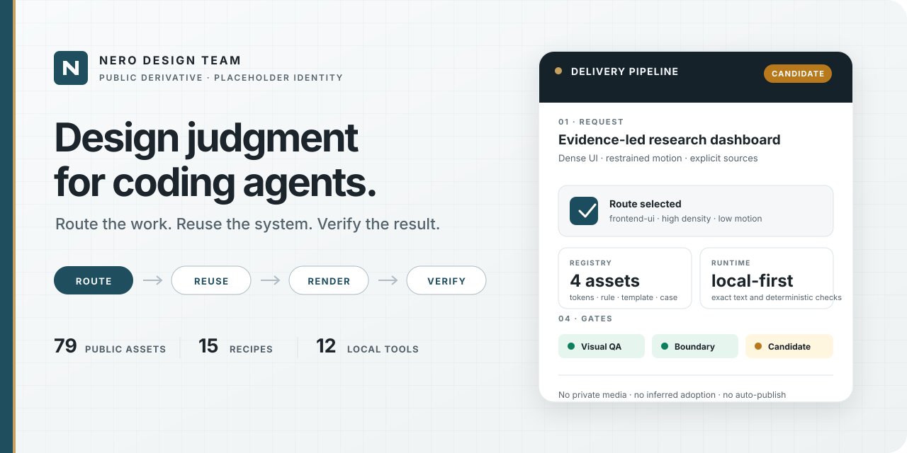
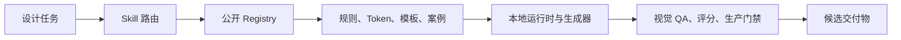

# NERO Design Team

<p align="center">
  
</p>

<p align="center">
  <strong>面向 Coding Agent 的受控设计操作系统。</strong><br>
  把一次性的 AI 视觉产出，变成可路由、可复用、可验证的交付流程。
</p>

<p align="center">
  <a href="README.md">English</a> · 简体中文
</p>

<p align="center">
  <code>NDT 3.0.0</code> · <code>12 项可分发资产</code> · <code>16 个配方</code> · <code>MCP 2.5.0</code> · <code>Apache-2.0</code>
</p>

NERO Design Team（NDT）给 Coding Agent 的不只是一段视觉提示词。它会先判断任务路由，再选择可复用设计资产；能确定性完成的部分由本地工具执行，并把 QA、候选状态和正式采用边界保持显式。

公开包覆盖前端 UI、AI 应用界面、架构图重绘、研究长图、确定性报告图、演示生产流程与下游交接、Web Deck、短视频、AI 图片 brief、视觉审阅、评分和生产检查。

> **公开边界：** 本仓库是经过公开安全净化的非权威派生版。客户材料、私人身份、正式品牌资产、私有预览媒体以及受限第三方资产均不包含在内。

## 为什么需要 NDT

Coding Agent 很快就能生成一个页面或一张幻灯片。真正困难的是：下一次产出能否延续之前的判断，能否复用已有资产，能否遵守证据边界，以及能否证明它通过了正确的检查。

NDT 把这条路径变成显式流程：

- **路由：** 先判断交付物类型，再选择工具。
- **复用：** 从已登记的规则、Token、模板、案例和配方中选择。
- **渲染：** 准确文字、数据和几何关系优先由确定性本地运行时完成。
- **验证：** 正式采用前执行视觉 QA、评分和生产门禁。

| 能力 | 组件库 | 提示词集合 | NERO Design Team |
|---|---:|---:|---:|
| UI 组件 | 核心能力 | 无 | 可选输入 |
| 设计任务路由 | 无 | 非正式 | 有 |
| 可复用资产 Registry | 无 | 无 | 12 项可分发资产 / 16 个配方 |
| 确定性本地运行时 | 无 | 无 | 有 |
| 显式 QA 与候选状态 | 无 | 无 | 有 |
| 公开/私有资产边界 | 项目自行处理 | 通常没有 | 内置于公开包 |

## 3.0 的主要更新

本次发布把公开发行包和 NDT 核心架构基线统一为 `3.0.0`，并把“软件与网页界面仅支持桌面端”设为硬边界。

- 新的“方法优先”设计合同会根据任务大小选择路径：小修复可以直接检查、修改、复核；重要新方向再进入参考探索、方向比较、代表性试样、看图改进和候选沉淀。
- 稳定 MCP Bridge 升级为 `2.5.0`。工具合同保持稳定，兼容的规则、代码和目录更新按调用读取。
- 资产 Registry 重新区分可复用资产、完整案例、辅助资料、成熟度、复用状态、十个视觉标签维度、版本化风格和带 revision 的维护入口。
- 新增 `ai-app-ui` 与架构图/重绘合同，覆盖 Agent 状态、信任边界、桌面窗口行为、语义图型选择以及 Mermaid/draw.io 的保真重绘。
- 删除移动端/平板端 UI、手机网页伴随版、移动断点以及原多设备 QA 工具；移动端 UI 请求会在生成代码或资产前 fail-closed。
- 视觉评分与生产检查共用适用性和当前文件证据规则；总分不能绕过缺失的产物、预览、内容或可访问性证据。

公开目录目前包含 12 项可实际分发的可复用资产、9 个公开安全案例、58 条辅助资料和 16 个配方。规则、工具、快照和兼容 ID 单独分类，不再全部计入“设计资产”。

## 快速开始

### 1. 安装 Codex Skill

```bash
git clone https://github.com/cyanask/nero-design-team.git
cd nero-design-team
node install.mjs
node doctor.mjs
```

安装器会把 Skill 复制到 `$CODEX_HOME/skills/nero-design-team/`；如果没有设置 `CODEX_HOME`，则使用 `~/.codex/skills/nero-design-team/`。随后，把 [`AGENTS.template.md`](AGENTS.template.md) 中的路由片段加入全局或项目级 `AGENTS.md`。

之后可以直接用自然语言向 Coding Agent 提出任务：

```text
调用 NERO Design Team，设计一个紧凑的研究工作台。
保留明确的证据层级，并在判断完成前执行视觉 QA。
```

### 2. 不安装，先查看能力

```bash
node scripts/nero-design.mjs list
node mcp-lite/server.mjs --list-tools
```

### 3. 运行公开 Registry 浏览器

```bash
cd frontend
npm ci
npm run demo
```

Demo 模式使用合成 fixture；它不是真实项目观测数据、在线 Demo 或生产证据。公开 Registry 的读取和测试命令见 [`frontend/README.md`](frontend/README.md)。

## 工作方式



公开前端是这套流程的只读投影。它包含应用场景路由、解决方案页面、资产目录、来源状态和显式采用记录；不会仅因为某个项目引用了 NDT，就推断某项资产已经被正式采用。

## 核心路由

| 路由 | 典型任务 |
|---|---|
| `frontend-ui` | 桌面 Dashboard、工作台、软件 UI、交互审阅 |
| `image-report` | 研究卡片、长图、嵌入式解释图 |
| `ppt` | PPT/PPTX 视觉方向、Web Deck、生产交接合同 |
| `short-video` | 分镜、动效系统、逐帧 QA |
| `ai-image-generation` | 视觉素材的艺术指导 brief |
| `case-library` | 可公开复用的设计合同与快照 |
| `visual-audit` | 以问题为先的设计审阅 |
| `visual-score` | 结构化的成熟度评分 |
| `production-check` | 格式、边界与交付门禁 |

## 确定性 Figure Compiler

`image-report` 路由包含 Figure Compiler v0.2，用于制作单张、有证据边界的结构解释图：

- 支持 flow、hierarchy、timeline、funnel、bar、line、participant map、matrix 和 value chain 九种图型；
- 提供 `report-a4`、`wechat-inline` 和 `ppt-16x9` 三种 profile；
- 无需 Pillow 即可输出 SVG；安装 Python 与 Pillow 后可输出高分辨率 PNG；
- Figure Spec 和编译 receipt 均保存在项目本地，不引入数据库或任务服务。

Compiler 只生成候选产物，不会自动 promote、嵌入、提交或发布；需要真正可编辑时，也不会替代原生 Office 对象。

## 验证公开包

```bash
npm run registry:check
npm run test:mcp
npm run test:figure-compiler
npm run test:stable-bridge
npm run test:skill-contracts
npm run test:asset-library
npm run test:style-library
npm run frontend:projection
npm run release:check
```

上述验证组合包括逐文件精确 allowlist、许可证检查、Registry 与引用闭合、前端投影检查、协议 smoke，以及私有路径、凭证、受限目录、不支持二进制文件和符号链接逃逸扫描。

## 仓库结构

```text
skills/nero-design-team/      Skill 入口与参考规则
registry/                     公开资产和路由合同
frontend/                     只读公开 Registry 浏览器
rules/                        路由、设计与 QA 规则
tokens/ 和 build/             Token 真源与确定性构建结果
templates/                    最小项目模板和 preset
tools/runtime/                本地运行时，包括 Figure Compiler
mcp-lite/                     本地工具服务与协议检查
scripts/                      生成器、验证器、评分和发布门禁
case-library/                 公开安全合同与 metadata 快照
brand/ 和 profiles/           明示为占位符的公开 profile 资产
docs/                         打包与公开边界文档
```

## 公开材料与私有材料

私有或客户相关材料应放在独立 overlay 中。不得向本仓库加入客户证据、截图、凭证、正式身份资产、私有验证历史或受限第三方文件。

仓库内置 Logo 是明示占位符，不代表 NERO 或任何客户的正式身份。公开 Registry 的媒体默认只保留 metadata；只有在再分发权利和公开边界均已确认后，才可打包实体文件。

新增资产前，请阅读 [`docs/oss-boundary.md`](docs/oss-boundary.md)、[`docs/private-overlay.md`](docs/private-overlay.md) 和 [`LICENSE-NOTES.md`](LICENSE-NOTES.md)。

## 当前边界

- 安装器目前面向 Codex Skill 目录。
- Registry 浏览器是本地只读工具；仓库不包含托管服务或遥测。
- 随包公开前端版本为 `0.5.0`，已对照私有前端 `0.5.11` 真源重新核对，并固定 900px 最小桌面画布。移动端/平板端适配、原生桌面封装、Registry 写入界面、私有预览媒体及其本地视觉外壳不进入公开包。
- NDT 不支持移动端/平板端软件 UI、手机网页伴随版或响应式移动适配。公众号竖图和竖版视频仍属于媒体输出，不构成移动端 UI 能力。
- 公开发行版有意保持为非权威派生版。
- 私有预览、原生桌面封装和项目专属 Manifest 不打包。
- 正式可编辑 Office 交付仍需显式下游交接和对应格式 QA。

## 参与贡献

欢迎提交缺陷、文档改进、公开安全规则、确定性运行时测试和合成 fixture。请先阅读 [`CONTRIBUTING.md`](CONTRIBUTING.md)，并且不要在 Issue 或 Pull Request 中放入客户或受限材料。

## 许可证

本项目采用 Apache License 2.0。详见 [`LICENSE`](LICENSE) 和 [`LICENSE-NOTES.md`](LICENSE-NOTES.md)。
